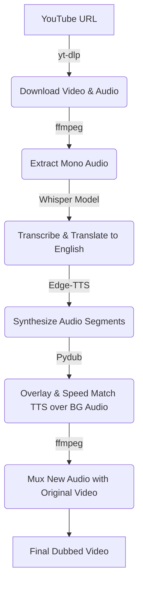

# Automated Video Dubbing System

An end-to-end Python pipeline that automatically downloads, transcribes, translates, synthesizes, and overlays English speech onto any foreign-language YouTube video. 

Using **OpenAI's Whisper** for speech-to-text translation, **Microsoft Edge TTS** for natural-sounding voice generation, and **FFmpeg & Pydub** for precise audio processing, this script creates fully dubbed video files in minutes.

---

## 🚀 Features

* **One-Command Dubbing:** Just pass a YouTube URL, and the script handles the download, dubbing, and muxing.
* **Background Audio Preservation:** Duck (attenuate by `-18dB`) and preserve the original background music, ambient noise, and sound effects instead of replacing them with absolute silence.
* **Auto-Speed Matching:** Automatically speeds up (time-stretches) synthesized TTS audio segments that exceed the original segment duration to maintain perfect video-audio synchronization.
* **Robust Synthesis & Error Handling:** Built-in retry mechanism with delays for network-resilient TTS generation. Skips failing segments instead of crashing.
* **Zero Video Re-encoding:** Copy-muxes the video track to keep the original quality intact and minimize processing time.

---

## 🛠️ How It Works



---

## 📋 Prerequisites

### 1. FFmpeg & FFprobe
The pipeline relies on `ffmpeg` and `ffprobe` to be available. The script is configured to look for these binaries in the project's root folder first. 

* *Note:* If you don't have them in the root directory, ensure they are installed on your system PATH:
  ```bash
  sudo apt update && sudo apt install ffmpeg
  ```

---

## ⚙️ Installation

1. **Clone the repository:**
   ```bash
   git clone https://github.com/YOUR_USERNAME/YOUR_REPO_NAME.git
   cd YOUR_REPO_NAME
   ```

2. **Create and activate a virtual environment:**
   ```bash
   python3 -m venv venv
   source venv/bin/activate
   ```

3. **Install dependencies:**
   ```bash
   pip install -r requirements.txt
   ```

---

## 💻 Usage

Run the script by providing a YouTube URL and an output directory:

```bash
python dubber.py <YOUTUBE_URL> --outdir <OUTPUT_DIR> [OPTIONS]
```

### Options:
* `--outdir`: Directory where all temporary and final assets will be saved (Default: `output`).
* `--keep-bg`: Retain and duck (`-18dB`) the original background music/audio under the new English voiceover. Without this flag, the background is completely silent.

### Examples:

**Example 1: Voiceover style (Preserving background sounds)**
```bash
python dubber.py https://www.youtube.com/watch?v=VwmenPeK9rs --outdir Output --keep-bg
```

**Example 2: Clean style (Silent background, only dubbed voice)**
```bash
python dubber.py https://www.youtube.com/watch?v=jNQXAC9IVRw --outdir Output
```

---

## 🔮 Future Roadmap
* [ ] **Multi-Language Support:** Integrate a Translation API (like Google Translate or LLM API) to support dubbing from English into other target languages.
* [ ] **Speaker Diarization:** Detect different speakers in the original video and assign distinct TTS voices (e.g., male, female) accordingly.
* [ ] **Vocal Removal / Source Separation:** Integrate tools like Demucs to cleanly separate vocals from background music rather than using standard audio ducking.
